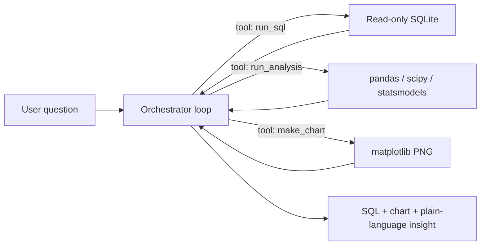

# 📊 Analyst-in-a-Box

**A dataset-agnostic AI data analyst.** Upload *any* tabular dataset (CSV/XLSX) or point it at a SQLite/Postgres DB, and it automatically understands the schema, then answers natural-language questions by writing and executing its own SQL, running statistical analysis, drawing charts, and writing a plain-language insight — like a junior data analyst.

> Nothing is hardcoded to a domain. The **same** agent code runs on a sales dataset, a sports dataset, and a student-records dataset with **zero code changes** — everything is derived from the schema at runtime.

### 🔗 [**Live demo → analyst-in-a-box.streamlit.app**](https://analyst-in-a-box-xyhk9grpaiknmnmqqtrege.streamlit.app/)

[](https://analyst-in-a-box-xyhk9grpaiknmnmqqtrege.streamlit.app/)
[](#)
[](#)

> Open the live app → click a **sample dataset** (Sales / Sports / Education) → ask a question in plain English or Hindi.

<!-- 🎬 DEMO GIF: drop a 30–60s screen recording at docs/demo.gif and it renders below -->
<!--  -->

---

## Why it's genuinely generic

The only dataset-specific thing the LLM ever sees is a **schema summary** built at load time:

```
TABLE "sales" (800 rows)
  - "region" TEXT (nulls=0, distinct=4) e.g. [East, West, North, South]
  - "revenue" FLOAT (nulls=0, distinct=800) e.g. [2582.88, 1405.89, ...]
  ...
```

That summary is injected into the system prompt for every question. There are **no column names, table names, or domain assumptions** anywhere in `agent/`.

---

## Architecture

```
                 ┌──────────────────────────────────────────────┐
   upload CSV/   │  schema_reader.py                            │
   XLSX / DB ───▶│  load → local SQLite → introspect schema     │
                 └───────────────────┬──────────────────────────┘
                                     │ schema summary (text)
                                     ▼
 user question ──▶  orchestrator.py  ──(tool-calling loop)──▶  LLM (Claude / OpenAI)
                         │  ▲                                     │
                         │  │  run_sql / run_analysis / make_chart│
                         ▼  │                                     │
                    tools.py  ◀──────────────────────────────────┘
                    (read-only SQL, stats, charts)
                         │
                         ▼
          SQL  +  chart  +  written insight  ──▶  Streamlit UI
```



The LLM **autonomously chains** the tools (e.g. `run_sql → run_analysis → make_chart → insight`) based on the question — it is not a fixed pipeline.

---

## Tech stack

| Layer | Choice |
|---|---|
| Language | Python 3.11+ |
| LLM | **Groq / Gemini (free)** or Anthropic / OpenAI (paid) — swap via `LLM_PROVIDER` |
| Agent loop | Lightweight custom tool-calling loop (no heavy framework) |
| Database | SQLite via SQLAlchemy |
| Analysis | pandas, scipy, statsmodels |
| Charts | matplotlib |
| UI | Streamlit |
| Deploy | Streamlit Community Cloud (primary) / Docker + HF Spaces |
| Tests | pytest-style eval harness |

---

## Project structure

```
analyst-in-a-box/
├── app.py                     # Streamlit entrypoint (upload → chat → SQL/chart/insight)
├── agent/
│   ├── schema_reader.py       # ingest any file → SQLite + schema introspection
│   ├── tools.py               # run_sql (safe), run_analysis, make_chart
│   ├── orchestrator.py        # tool-calling agent loop (anthropic | openai | mock)
│   ├── prompts.py             # domain-neutral system prompt + tool schemas
│   └── usage.py               # daily usage cap (SQLite counter)
├── data/
│   ├── make_sample_datasets.py
│   └── sample_datasets/       # sales.csv, sports.csv, education.csv
├── eval/
│   ├── test_questions.json    # 18 questions across 3 datasets
│   ├── run_eval.py            # runs agent, scores vs. independent ground-truth SQL
│   └── eval_results.json      # generated
├── Dockerfile / docker-compose.yml
├── requirements.txt
├── .env.example / .streamlit/secrets.toml.example
└── README.md
```

---

## Run locally

```bash
python -m venv .venv && source .venv/bin/activate   # Windows: .venv\Scripts\activate
pip install -r requirements.txt
python data/make_sample_datasets.py                 # writes the 3 sample CSVs

# set your key (do NOT commit it)
export ANTHROPIC_API_KEY=sk-ant-...                 # or OPENAI_API_KEY + LLM_PROVIDER=openai

streamlit run app.py
```

Then: pick a sample dataset (or upload your own) → inspect the auto-detected schema → ask questions.

---

## Evaluation harness

Proves generalization: the **same agent** is run against **18 questions across 3 unrelated datasets**. Ground truth for value questions is computed by executing an **independent SQL query** directly against the DB — so the agent is scored against reality, not a hardcoded answer.

```bash
python -m eval.run_eval                  # uses your real LLM (needs an API key)
python -m eval.run_eval --provider mock  # offline smoke test, no API cost
python -m eval.run_eval --limit 3        # quick check
```

### Results

**Real LLM — Groq `openai/gpt-oss-120b` (free tier):** the actual agent, run end-to-end against all 18 questions.

| Dataset | Passed |
|---|---|
| sales | 6/6 (100%) |
| sports | 5/6 (83%) |
| education | 5/6 (83%) |
| **Overall** | **16/18 (89%)** |

The two misses are strict-checker artifacts, not wrong analysis — e.g. for *"do male and female students differ in average exam score?"* the model answered correctly with direct SQL group averages instead of invoking the dedicated `group_compare` stat method the checker looked for. Same harness runs identically on `--provider anthropic` / `openai` / `gemini`.

**Offline planner (`--provider mock`, no API key):** a schema-driven keyword planner for zero-cost CI smoke tests — exercises the full pipeline (schema → tools → scoring) without any API spend. Scores **17/18 (94%)**, but is *deliberately dumber than a real LLM* and exists only so the harness can run in CI.

---

## Cost & abuse safety (done before any public deploy)

- **Per-session cap:** `MAX_SESSION_QUESTIONS` (default 15) tracked in `st.session_state`; a friendly message shows when hit.
- **Per-day global cap:** `MAX_DAILY_QUESTIONS` (default 200) tracked in a tiny SQLite counter (`agent/usage.py`).
- **No hardcoded keys:** read from `GROQ_API_KEY` / `GEMINI_API_KEY` / `ANTHROPIC_API_KEY` / `OPENAI_API_KEY` (env or Streamlit Secrets). `.env` and `secrets.toml` are gitignored.
- **Read-only, sandboxed SQL:** generated queries are validated — only `SELECT`/`WITH`, single statement, `PRAGMA query_only`, `mode=ro` connection, forbidden-keyword blocklist (`INSERT/UPDATE/DELETE/DROP/…`), auto-`LIMIT`, and a query timeout.
- **Resilient LLM calls:** every provider call is wrapped in try/except with a timeout, so one bad call returns a friendly error instead of crashing the app.

---

## Deployment

### Streamlit Community Cloud (primary)
1. Push to a **public GitHub repo** (`.gitignore` already excludes `.env`, `__pycache__`, `data/*.db`).
2. Verify `requirements.txt` installs cleanly in a fresh venv.
3. On [share.streamlit.io](https://share.streamlit.io): connect the repo, set **`app.py`** as the entrypoint.
4. In the app's **Secrets** panel, paste (TOML) — a **free** Groq key works, no credit card:
   ```toml
   LLM_PROVIDER = "groq"
   GROQ_API_KEY = "gsk_..."   # free at https://console.groq.com/keys
   ```
5. Load a sample dataset and ask a question to confirm it works end-to-end **before sharing the link**.

### Docker / HuggingFace Spaces (alternative)
```bash
docker compose up --build          # local, reads keys from your .env
```
For HF Spaces (Docker SDK): push the repo, add the key under **Repository secrets** using the same env-var names.

---

## Design decisions & judgment calls

- **Custom tool-calling loop over LangGraph** — for 3 tools and a linear-ish chain, a ~150-line loop is easier to read, debug, and keep provider-agnostic than pulling in a framework.
- **Everything routed through SQL** — even uploaded flat files are loaded into SQLite so there's one safe, validated execution path (read-only) instead of executing arbitrary pandas.
- **Provider-swappable (`groq` | `gemini` | `anthropic` | `openai` | `mock`)** — Groq/Gemini give a free tier; the `mock` provider is a key-free test double so the eval harness and pipeline can be validated in CI without API spend.
- **Schema summary is the only dataset context** — this is the core design choice that keeps the system generic.

---

## License

[MIT](LICENSE) — free to use, modify, and share.
